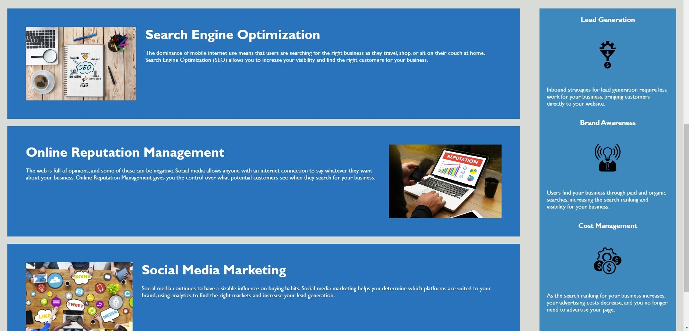

# Bootcamp Challenge 1: Horiseon Demo
On-The-Job Ticket challenge based on making webpages more accessible.

## Description
This repo contains source code for Horiseon's homepage.

Bootcamp Challenge 1 is a on-the-job ticket from a company called Horiseon who have requested an update to their HTML and CSS in order to make the code follow modern web standards. This is to improve webpage accessibility and Search Engine Optimization performance. 

### User Story:
```
AS A marketing agency
I WANT a codebase that follows accessibility standards
SO THAT our own site is optimized for search engines 
```
### Changes:
- Changed `div` elements for semantic HTML elements like `nav`, `aside` and `footer`.
- Added `alt` attributes to images.
- Changed heading tags to fall in sequential order.
- Fixed broken link.
- Consolidated inefficient/duplicate CSS classes.
- Added comments to HTML and CSS with appropriate titles.
### Extra Upgrades:
- Added link to homepage in header logo.
- Improved responsiveness for 1080p desktop experience using `flex`.
### Preview of webpage:



## Installation
N/A

## Usage
Deployed webpage can be found here:  [Horiseon - Homepage](https://c4rli.github.io/Bootcamp-Challenge-1-Horiseon-Demo/)

## Credits
Original code supplied by Horiseon.

## License
Please refer to the LICENSE in the repo.